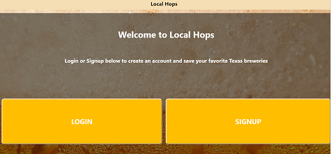
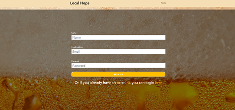
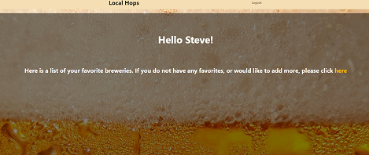
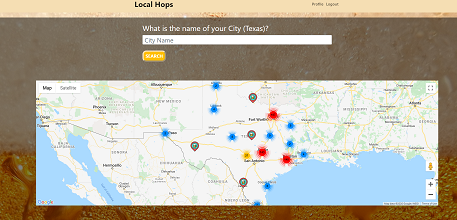
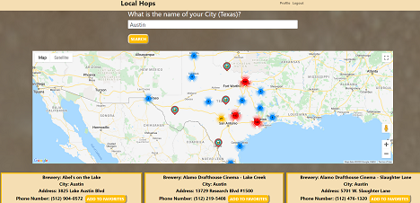
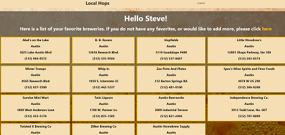

# Local Hops

   [](#License)

   ## Description
   This app will allow a user to create an account and select their favorite Texas breweries from all acrosss the state. The user will have a profile page that displays all of their selections. The seletions are made through a city search and a Google map will showcase all of the brewery locations in Texas.

   ## Table of Contents
   * [Installation](#Installation)
   * [Usage](#Usage)
   * [License](#License)
   * [Contributions](#Contributions)
   * [Tests](#Tests)
   * [Questions](#Questions)
   
   ## Installation
   To install, please run the following code in the terminal:

   ```
   npm install
   ```

   You will also need to have MySQL installed on your computer. This readme does not walkthrough the steps to do that, so you will have to look elsewhere online for that information. I am using MySQL Workbench for the database and this readme will assume you are using the same. However, you may use the MySQL application of your choosing.

   ## Usage
   To use this app, copy the code from the schema.sql file into MySQL Workbench to create the database.
   
   Once that is done, please run the following code in the terminal:

   ```
   node server.js
   ```

   This will create the tables needed for the app. Now that the tables are created, import the beermap.texas.csv file into the breweries table by right-clicking the table and selecting "Table Data Import Wizard". Follow the steps of the wizard until you see a list of the colums with checkboxes next to them. The longitude is the first column and the lat is the second column, so change these in the drop down. The columns after that just need to be changed in the drop down to match the value. The last column after the brewery type needs to be unchecked as it contains data that is not used by this app.

   ***+++Note you may need to restart the server after this is completed to insure the table data is saved+++***

   ## License
   The license associated with this project is MIT.
   To view the license information, visit the link [here](https://github.com/CalebParris/Local-Hops/blob/main/LICENSE)

   ## Contributions
   This app was made with several contribututions from the following people:

   [](https://github.com/CalebParris)
   [](https://github.com/rubenfiv)
   [](https://github.com/guillenjoshua)
   [](https://github.com/sahibamj)

   ## Tests
   To test the app, follow the directions from the Installation and Usage sections first. Then go to the following url in your browser:

   ```
   https://localhost:3000
   ```

   Once there, you will be brought to a home page asking you to either login or signup. If you do not have an account (which you won't if this is the first time running the app), click the signup button and fill out the fields.

   
   

   After you are signed in, you will be taken to a profile page that lists all of your selected favorite breweries (this will be mostly blank until you actually favorite some breweries). On this page you can either logout, or go to the brewery search page.

   

   On the brewery search page, you will see a search bar that will let you enter a city in Texas and get a list of all the breweries in that area. Underneath the search bar is a map that is already populated with all the brewery locations in Texas to make choosing a city easier. Once the city has been entered, the previously mentioned list of breweries will appear beneath the map. When you click on the "Add to Favorites" button, that brewery's information will then be sent to your profile page.

   
   
   

   To see the deployed finished product, you can visit the link below:
   
   [https://local-texas-hops.herokuapp.com/](https://local-texas-hops.herokuapp.com/)

   ## Questions
   If you have any comments, questions, or concerns about this project, please post them [here](https://github.com/CalebParris/Local-Hops/issues) and I will respond as soon as I am able.

   Otherwise, you can contact me through the following means:
   * Email: calebparris@live.com
   * Github: [CalebParris](https://github.com/CalebParris)
    
